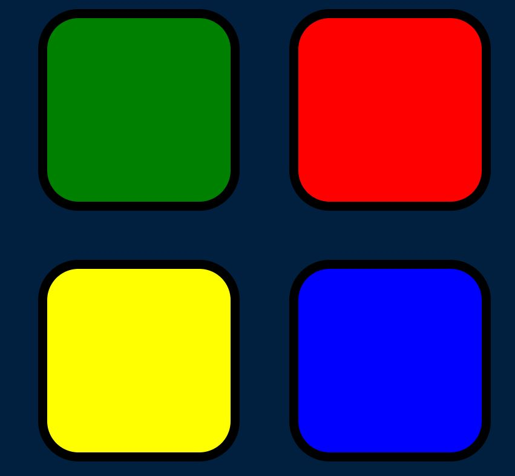
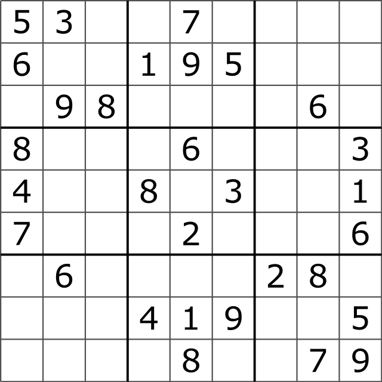
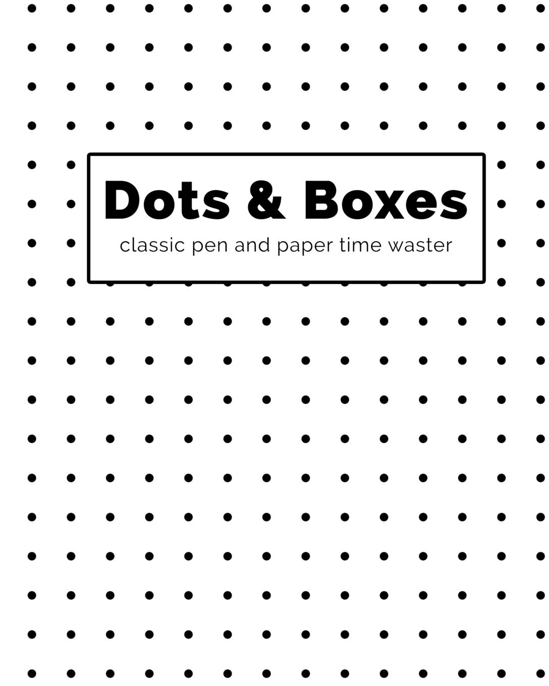

A
RDBMS Mini Project
On
“Online Games”

 

Submitted By:                                                                  Class & Sec.:
Straw Hats          			                                                              MCA-B
Achint Tyagi
Ajay Dhondge
Amit Sanap
Ishansingh Rana
Omkar Kende
				Submitted To:                                                                                                      
           		    Prof. Akshit Mithaiwala

ACKNOWLEDGEMENT
This is a mini-project submitted to Maharashtra Institute of Technology, World Peace University (MIT-WPU) by the students of FYMCA, Achint Tyagi, Ajay Dhondge, Amit Sanap, Ishansingh Rana, Omkar Kende and Amit Sanap, for the academic year 2022-2023.
A project is a bridge between theoretical and practical learning and helps in the complete development of the students.
While we were working on this project, it helped us in practically understanding various front-end and back-end languages. The preparation of this computer science project was an immense learning experience and we inculcated many personal qualities during this process like responsibility, punctuality, confidence, teamwork, problem solving and leadership. Completing a project gave us confidence about our practical skills and helped us in knowing our capabilities.

INTRODUCTION

It is a platform which allows users to play games online. The users can choose their favourite game from a list of games. One can play individual games like snake, doodle, sudoku, drums & colour game as well as 2-player games like dots and boxes
This website has been developed using technologies like PHP, JavaScript, HTML, CSS, Sql, Ajax etc.

 
REQUIREMENT SPECIFICATIONS

Hardware Requirements:
•	Device: PC/Laptop
•	Processor: Intel® Core(TM) i3-3210 CPU@ 3.20GHz 3.20GHz
•	System Type: 64-bit OS, x64-based processor
•	OS: Windows 7 and above

Software Requirements:

1.	Front-end Technologies:
	HTML
	CSS
	JavaScript

2.	Back-end Technologies:
	MySQL
	PHP

Different Screens
•	Landing Page:
 

•	Snake
 

•	Sudoku:
 

•	Colour Game:
 

•	Dots and Boxes:
 
•	Drums:
 

•	Doodle:
 
•	Leaderboard:   
•	Feedback
 

•	Team

 

LIMITATIONS

•	A user profile is not maintained.
•	There is no login option.
•	A user’s previously played matches and his recent scores cannot be see.
•	Only a maximum of 2 players can play a game.
•	Friends cannot be added.
•	There is no option to play with a friend online.
 
FUTURE ENHANCEMENTS

•	A user profile will be maintained.
•	A  login option will be provided.
•	A provision to access a user’s previously played matches and his recent scores will be made.
•	Option to add friends will be added.
•	Users can play with a friend who is online at the same time.
•	More exciting games will be added.
•	More multiplayer games will be introduced.

 
SOURCE CODES:
Index Page
<!DOCTYPE html>
<html lang="en">
  <head>
    
    <!--head bar-->
    

    
    <!--end of head bar-->
    <title>Home</title>

  </head>

  <body>
    <!--Error Tab-->
 

<!--end of Error Tab-->

    <!--Navigation bar-->

    

    
    <!--end of Navigation bar-->

    

      <h1>Bored!!!</h1>
      <h5>Playing Simple & Small Games can help Sometime...😉</h5>
    

    

      

        

          

          

            <a href="Colour_game/index.html">
              <h4>Colour Game</h4></a>
          

          

            <a href="Snake/index.html"
              > <h4>Snake</h4> </a>
          

          

        

      

    

    

      

        

        

      <a href="games.html"><b><h5>More Games <i class="fas fa-arrow-right"></i></h5></b>
        
      </a>
    

  

  

    <!--Footer bar-->

    

    
    <!--end of Footer bar-->
    

  </body>
</html>

Navbar Section
<nav class="navbar navbar-expand-lg ">
    

      <ul class="navbar-nav">
        <a href="index.html" class="nav-link">
          <li class="nav-item">Home</li>
        </a>
        <a href="games.html" class="nav-link">
          <li class="nav-item">Games</li>
        </a>
        
        <a href="team.html" class="nav-link">
          <li class="nav-item">Team</li>
        </a>
      </ul>
      <ul class="navbar-nav navbar-ul2">
        <a href="score.html" class="nav-link">
          <li class="nav-item">Score</li>
        </a>
        <a href="feedback.html" class="nav-link">
          <li class="nav-item">Feedback</li>
        </a>
        
      </ul>
    

  </nav>

Footer Section
<footer>
    

      

        Making mistakes is better than faking perfection
      

      
Copyright © 2022

    

  </footer>

Head Seaction
<meta charset="UTF-8" />
  <meta http-equiv="X-UA-Compatible" content="IE=edge" />
  <meta name="viewport" content="width=device-width, initial-scale=1.0" />
  <link rel="icon" type="image/x-icon" href="favicon.ico"><!--  favicon -->
  <link href="https://cdn.jsdelivr.net/npm/bootstrap@5.2.2/dist/css/bootstrap.min.css" rel="stylesheet"
    integrity="sha384-Zenh87qX5JnK2Jl0vWa8Ck2rdkQ2Bzep5IDxbcnCeuOxjzrPF/et3URy9Bv1WTRi" crossorigin="anonymous" />
  <link href="https://fonts.googleapis.com/css2?family=Fasthand&display=swap" rel="stylesheet" />
  <link rel="stylesheet" href="style.css" />
  <meta name="viewport" content="width=device-width, initial-scale=1" />
    <link rel="stylesheet" id="font-awesome-official-css" href="https://use.fontawesome.com/releases/v5.15.4/css/all.css" media="all" integrity="sha384-DyZ88mC6Up2uqS4h/KRgHuoeGwBcD4Ng9SiP4dIRy0EXTlnuz47vAwmeGwVChigm" crossorigin="anonymous">
    <link
      rel="stylesheet"
      href="https://cdnjs.cloudflare.com/ajax/libs/font-awesome/4.7.0/css/font-awesome.min.css"
    /> 
    <link href="https://fonts.googleapis.com/css2?family=Acme&display=swap" rel="stylesheet">
    <link href="https://fonts.googleapis.com/css2?family=Carter+One&display=swap" rel="stylesheet">
    <link href="https://fonts.googleapis.com/css2?family=Fredoka+One&display=swap" rel="stylesheet">
    <link href="https://fonts.googleapis.com/css2?family=Edu+NSW+ACT+Foundation:wght@700&display=swap" rel="stylesheet">
    <link href="https://fonts.googleapis.com/css2?family=Arima:wght@500&display=swap" rel="stylesheet">
    <link href="https://fonts.googleapis.com/css2?family=Dancing+Script:wght@700&display=swap" rel="stylesheet">
    <link href="https://fonts.googleapis.com/css2?family=Acme&display=swap" rel="stylesheet">

    <link href="https://fonts.googleapis.com/css2?family=Acme&family=Fredoka+One&display=swap" rel="stylesheet">
    <link href="https://fonts.googleapis.com/css2?family=Permanent+Marker&display=swap" rel="stylesheet">
    <link href="https://fonts.googleapis.com/css2?family=Fira+Mono:wght@500&display=swap" rel="stylesheet">
    
    <link rel="stylesheet" href="https://fonts.googleapis.com/css2?family=Material+Symbols+Outlined:opsz,wght,FILL,GRAD@48,700,1,0" />
    
    

Team Page
<!DOCTYPE html>
<html lang="en">
  <head>
    
    <!--head bar-->
    

    
    <!--end of head bar-->
    <title>Team</title>

  </head>
  <body>
    <!--Error Tab-->
 

<!--end of Error Tab-->

    <!--Navigation bar-->

  

  
  <!--end of Navigation bar-->
    

      <h1>Meet the Developers...</h1>
      

        

          

            

              
              

                <h4><b>Achint Tyagi</b></h4>
                <h5>Frontend Designer </h5>
                <a href="https://www.linkedin.com/in/achint-tyagi" target="_blank"
                  ><i class="fa fa-linkedin-square" aria-hidden="true"></i>
                  
                </a>
              

            

          

          

            

              
              

                <h4><b>Ajay Dhondge</b></h4>
                <h5>Game Developer</h5>
                <a href="https://www.linkedin.com/in/ajay-dhondge-617568214" target="_blank"
                  ><i class="fa fa-linkedin-square" aria-hidden="true"></i>
                </a>
              

            

          

          

            

              
              

                <h4><b>Amit Sanap</b></h4>
                <h5>Game Developer</h5>
                <a href=""
                  ><i class="fa fa-linkedin-square" aria-hidden="true"></i>
                </a>
              

            

          

        

      

      

        

          

          

            

              
              

                <h4><b>Omkar Kende</b></h4>
                <h5>Database Designer</h5>
                <a href=""
                  ><i class="fa fa-linkedin-square" aria-hidden="true"></i>
                </a>
              

            

          

          

            

              
              

                <h4><b>Ishansingh Rana</b></h4>
                <h5>Database Designer</h5>
                <a href="https://www.linkedin.com/in/ishan-rana-57488a249" target="_blank"
                  ><i class="fa fa-linkedin-square" aria-hidden="true"></i>
                </a>
              

            

          

          

        

      

    

    <!--Footer bar-->

  

  
  <!--end of Footer bar-->
  

  </body>
</html>

Score Page
<!DOCTYPE html>
<html lang="en">
  <head>
    
    <!--head bar-->
    

    
    <!--end of head bar-->
    <title>Highscore</title>
  </head>

  <body>
    <!--Error Tab-->
 

<!--end of Error Tab-->

    <!--Navigation bar-->

    

    
    <!--end of Navigation bar-->
    <h1 id="score_h1">Leaderboard...</h1>
    

      

      

        <h2 class="game_heading">Snake</h2>
    <table id="Snake">
      <tr> 
        <th id="s_no">S No.</th>
        <th>Player's Name</th>
        <th>Date</th>
        <th>Score</th>
      </tr>
      <tr>
        <td class="S-no">1</td>
        <td class="pname">---</td>
        <td class="gdate">---</td>
        <td class="pscore">--</td>
      </tr>
      <tr>
        <td class="S-no">2</td>
        <td class="pname">---</td>
        <td class="gdate">---</td>
        <td class="pscore">--</td>
      </tr>
      <tr>
        <td class="S-no">3</td>
        <td class="pname">---</td>
        <td class="gdate">---</td>
        <td class="pscore">--</td>
      </tr>
      <tr>
        <td class="S-no">4</td>
        <td class="pname">---</td>
        <td class="gdate">---</td>
        <td class="pscore">--</td>
      </tr>
      <tr>
        <td class="S-no">5</td>
        <td class="pname">---</td>
        <td class="gdate">---</td>
        <td class="pscore">--</td>
      </tr>
    </table>
    

    

      <h2 class="game_heading">Doodle</h2>
      <table id="Sudoku">
        <tr> 
          <th id="s_no">S No.</th>
          <th>Player's Name</th>
          <th>Date</th>
          <th>Score</th>
        </tr>
        <tr>
          <td class="S-no">1</td>
          <td class="pname">---</td>
          <td class="gdate">---</td>
          <td class="pscore">--</td>
        </tr>
        <tr>
          <td class="S-no">2</td>
          <td class="pname">---</td>
          <td class="gdate">---</td>
          <td class="pscore">--</td>
        </tr>
        <tr>
          <td class="S-no">3</td>
          <td class="pname">---</td>
          <td class="gdate">---</td>
          <td class="pscore">--</td>
        </tr>
        <tr>
          <td class="S-no">4</td>
          <td class="pname">---</td>
          <td class="gdate">---</td>
          <td class="pscore">--</td>
        </tr>
        <tr>
          <td class="S-no">5</td>
          <td class="pname">---</td>
          <td class="gdate">---</td>
          <td class="pscore">--</td>
        </tr>
      </table>
      

    

    

      

      

        <h2 class="game_heading">Colour Memory</h2>
    <table id="ColourMemory">
      <tr> 
        <th id="s_no">S No.</th>
        <th>Player's Name</th>
        <th>Date</th>
        <th>Score</th>
      </tr>
      <tr>
        <td class="S-no">1</td>
        <td class="pname">---</td>
        <td class="gdate">---</td>
        <td class="pscore">--</td>
      </tr>
      <tr>
        <td class="S-no">2</td>
        <td class="pname">---</td>
        <td class="gdate">---</td>
        <td class="pscore">--</td>
      </tr>
      <tr>
        <td class="S-no">3</td>
        <td class="pname">---</td>
        <td class="gdate">---</td>
        <td class="pscore">--</td>
      </tr>
      <tr>
        <td class="S-no">4</td>
        <td class="pname">---</td>
        <td class="gdate">---</td>
        <td class="pscore">--</td>
      </tr>
      <tr>
        <td class="S-no">5</td>
        <td class="pname">---</td>
        <td class="gdate">---</td>
        <td class="pscore">--</td>
      </tr>
    </table>
    

    

    

    <!--Footer bar-->

    

    
    <!--end of Footer bar-->
    

  </body>
</html>

Games Page
<!DOCTYPE html>
<html lang="en">
<head>
  
    <!--head bar-->
    

    
    <!--end of head bar-->
    
    <title>Games</title>
</head>
<body>
  <!--Error Tab-->
 

<!--end of Error Tab-->

    <!--Navigation bar-->

  

  
    

        

          
          

            

            

                
              
                    <a href="Sudoku/index.html" >
                        <h4>Sudoku</h4></a>
            

    
            

              <a href="Dots&Boxes/index.html">
                  <h4>Dots & Boxes</h4></a>
            

    
            

            

          

          

            

            

              
                  <a href="Doodle/index.html">
                    <h4>Doodle</h4></a>
            

    
            

                <a href="Snake/index.html" >
                <h4>Snake</h4></a>
            

    
            

            

          

          

            

            

              <a href="Drum_sound/index.html">
                  <h4>Drum Kit</h4></a>
            

    
            

                <a href="Colour_game/index.html" >
                    <h4>Colour Game</h4></a>
            

    
            

            

          

        

      

      <!--Footer bar-->

  

  
  <!--end of Footer bar-->
  

</body>
</html>

Feedback Page
<!DOCTYPE html>
<html lang="en">
  <head>
    
    <!--head bar-->
    

    
    <!--end of head bar-->
    <title>Feedback</title>
  </head>
 

<body>
  <!--Error Tab-->
 

<!--end of Error Tab-->

  <!--Navigation bar-->

  

  
  <!--end of Navigation bar-->
  

    

      

        
      

      

        <h2>Review us...</h2>
        <form action="https://formspree.io/f/xvoynzkk" method="POST">
          <input
            type="text"
            id="name"
            name="name"
            placeholder="Name*"
            required
          /> 
          <input
            type="email"
            id="email"
            name="email"
            placeholder="Email*"
            required
          /> 

          

            <input
              type="radio"
              class="radio"
              id="Happy"
              name="group"
              required
            />

            <input type="radio" class="radio" id="Normal" name="group" />
            <input type="radio" class="radio" id="Angry" name="group" />

             
            <label for="radio-1"
              >
                sentiment_very_satisfied
              </label
            >
            <label for="radio-2"
              >
                sentiment_neutral
              </label
            >

            <label for="radio-3"
              >
                sentiment_extremely_dissatisfied
              </label
            >
          

           
          <textarea
            id="subject"
            name="subject"
            placeholder="Message*"
            required
          ></textarea>

           
          <input id="submit" type="submit" value="Submit" required />
          <input id="reset" type="reset" value="Reset" required />
        </form>
      

    

  

  <!--Footer bar-->

  

  
  <!--end of Footer bar-->

   
 </body>
  
  

  
</html>

Error Page

    

        
            star
        
        star
        
        
            star
        
        star
        
        
            star
        
        star
        
        
            star
        
        star
        
        
            star
        
        star
        
        
            star
        
        star
        
        
            star
        
        
            star
        
        
            star
        
        
            star
        
        
            star
        
        
            star
        
            star
        
        
            star
        
        
            star
        
        
            star
        
            star
        
        
            star
        
        
            star
        
        
            star
        
            star
        
        
            star
        
        
            star
        
            star
        
    

    

        
        <h1>Error</h1>
        <h2>Couldn't launch :(</h2>
        <h3>Page Can't Load in Small Screen</h3>
    

Style Sheet

@media screen and (min-width:1180px) {
  #error_page{
    display: none;
  }
  body {
    margin: 0;
    background-color: #fff;
  }
  /* **************Navbar**************** */
  nav {
    /* background-color: #A9A9A9; */
    /* background-color: #D7CEC7 ; */
    background-color: #f5f5f5;
    padding: 1mm 2mm 1mm 3mm;
    border-bottom: #d7d7d7 0.1mm solid;
  }
  
  a li.nav-item {
    font-weight: bolder;
    font-size: 1.5rem;
    color: black;
    font-family: "Acme", sans-serif;
  }
  a li.nav-item:hover {
    text-shadow: 1px 3px rgba(0, 0, 0, 0.2);
  }
  
  .navbar-ul2 li {
    padding-left: 0.2cm;
  }
  /* ***********Footer**************************** */
  footer {
    background-color: #f5f5f5;
    text-align: center;
    color: black;
    font-weight: bolder;
    border-top: #d7d7d7 0.1mm solid;
  }
  
  footer div {
    padding: 3mm 0;
  }
  
  footer p {
    margin-bottom: 0.1mm;
  }
  /* --------------------------------------Home-page-------------------------------- */
  #scrooling_content {
    text-align: center;
    padding: 4cm 0;
  }
  #scrooling_content h1 {
    font-size: 5cm;
  }
  #home_games .col-md-4 {
    text-align: center;
  }
  #home_games .col-md-4 a img {
    height: 242px;
    width: 236px;
    box-shadow: 0 0 10px 1px rgba(0, 0, 0, 0.2);
  }
  #home_games a{
    text-decoration: none;
    color: #000000;
  }
 #home_games a h4 {
    text-align: center;
    padding: 3mm 0;
    font-family: "Carter One", cursive;
  }
  #home_games .col-md-4 a img:hover {
    box-shadow: 0 0 20px 5px rgba(0, 0, 0, 0.2);
  }
  #more-games {
    text-align: right;
    padding: 0 3mm 1cm 0;
  }
  #more-games a {
    text-decoration: none;
    color: black;
    font-family: "Acme", sans-serif;
  }
  #more-games a h5:hover {
    text-shadow: 1px 3px rgba(0, 0, 0, 0.2);
  }
  
  /* --------------------------------------Game-page-------------------------------- */
  
  #games .col-md-4 a img {
    height: 242px;
    width: 236px;
    box-shadow: 0 0 10px 1px rgba(0, 0, 0, 0.2);
  }
  #games .col-md-4 a img:hover {
    box-shadow: 0 0 20px 5px rgba(0, 0, 0, 0.2);
  }
  
  #games {
    margin-top: 5mm;
  }
  #games a {
    text-decoration: none;
    color: black;
  }
  #games a h4 {
    text-align: center;
    padding: 3mm 0;
    font-family: "Carter One", cursive;
  }
  #games a h4:hover {
    text-shadow: 1px 3px rgba(0, 0, 0, 0.2);
  }
  
  #games .col-md-4 {
    margin: 1cm 0;
    text-align: center;
  }
  /* --------------------------------------TEAM-page-------------------------------- */
  
  #team .card {
    box-shadow: 0 4px 8px 0 rgba(0, 0, 0, 0.2);
    transition: 0.5s;
    width: 67%;
    margin: auto;
    padding: 4mm 0;
  }
  #team div.row {
    margin: 7mm 0;
  }
  #team .card:hover {
    box-shadow: 1px 1px 10px 6px rgba(0, 0, 0, 0.2);
  }
  
  #team .container {
    padding: 2px 16px;
    text-align: center;
  }
  #team img {
    height: 7cm;
    width: 6cm;
    margin: auto;
  }
  #team a {
    text-decoration: none;
    color: black;
    font-size: 7mm;
  }
  #team h5 {
    font-family: "Carter One", cursive;
  }
  #team h1 {
    font-family: "Fredoka One", cursive;
    margin: 1cm 5mm;
  }
  #team h4 {
    font-family: "Acme", sans-serif;
    padding: 3mm 0 0 0;
  }
  
  /* --------------------------------------Score-page-------------------------------- */
  tr {
    border-bottom: 0.1mm solid black;
  }
  
  th {
    background-color: #bfa797;
    font-size: x-large;
    font-family: "Edu NSW ACT Foundation", cursive;
    color: black;
  }
  #Sudoku th{
    background-color: #A0E4CB;
  }
  #ColourMemory th{
    background-color: #D58BDD;
  }
  .game_heading{
    text-align: center;
    font-weight: bolder;
    border: solid;
    margin: 0 2mm;
    background-color: #BCCEF8;
  }
  table {
    margin: 7mm auto;
    min-width: 90%;
    font-family: "Arima", cursive;
    font-size: larger;
    font-weight: bold;
  }
  
  #score_h1 {
    margin: 5mm 0 5mm 3mm;
    font-family: "Fredoka One", cursive;
    font-size: 4rem;
  }
  
  tr:nth-of-type(odd) {
    background-color: #f7f7f7;
    color: #562b08;
  }
  
  #s_no {
    text-align: left;
    padding-left: 3mm;
  }
  
  td:nth-of-type(1) {
    text-align: left;
    padding-left: 3mm;
  }
  
  td {
    padding: 2mm 5mm 0 5mm;
  }
  
  
  /* --------------------------------------Feedback-page-------------------------------- */
  
  #feedback {
    background-color: rgb(177, 222, 232);
    margin: 8mm 1cm;
    border: noen;
    border-radius: 7mm;
  }
  
  #feedback .col-md-6 img {
    margin: 2.5cm 2cm 0 3.5cm;
  }
  
  #feedback input {
    margin: 0 0 1mm 0;
    display: block;
    width: 60%;
    background: #f7f7f7;
    font-family: "Fredoka One", cursive;
    font-size: 15px;
    line-height: 1.5;
    color: #666;
    border-radius: 5mm;
    padding: 2mm;
    border: none;
    outline: none;
  }
  
  #feedback textarea#subject {
    font-family: "Fredoka One", cursive;
    height: 150px;
    width: 60%;
    background: #f7f7f7;
    color: #666;
    border-radius: 5mm;
    padding: 2mm;
    border: none;
    outline: none;
  }
  
  #feedback #submit,
  #feedback #reset {
    width: 25%;
    display: inline;
    margin: 5mm 4mm 8mm 4mm;
  }
  
  #feedback #submit:hover,
  #feedback #reset:hover {
    background-color: #666;
    color: #f7f7f7;
    box-shadow: 1px 1px 10px 6px rgba(0, 0, 0, 0.2);
  }
  
  #feedback h2 {
    font-family: "Fredoka One", cursive;
    margin: 1cm 0 7mm;
    color: #666;
  }
  
  #rating label span {
    margin: 0 7mm 0 7mm;
    color: #666;
    font-size: 1cm;
  }
  
  #rating input {
    display: inline;
    width: auto;
    margin: 0 8mm 0 9mm;
  }
  
  #rating input.radio {
    height: 1cm;
    width: 0.7cm;
  }
  
  #rating input.radio#Angry,
  #rating input.radio#Normal,
  #rating input.radio#Happy {
    accent-color: lightslategrey;
    cursor: pointer;
  }
  
  #rating input.radio#Angry:checked ~ label span#angry,
  label span#angry:hover {
    color: red;
  }
  
  #rating input.radio#Happy:checked ~ label span#happy,
  label span#happy:hover {
    color: #54b435;
  }
  
  #rating input.radio#Normal:checked ~ label span#normal,
  label span#normal:hover {
    color: #fdff00;
  }
  
  #feedback .col-md-6 img:hover {
    will-change: transform;
    transform: perspective(300px) rotateX(1.38deg) rotateY(-4.01deg)
      scale3d(1.1, 1.1, 1.1);
  }
}

@media screen and (max-width:1180px) {
  #normalbody{
    display: none;
  }
/* --------------------------------------Error-page-------------------------------- */
 body{
  height: 95vh;
  background: #000000;
  text-align: center;
  color: #e0e0e0;
  font-family: "Fira Mono", monospace;
}

#error h1 {
  font-size: 2.5rem;
  font-family: "Permanent Marker", cursive;
  margin: 0;
}

#error h1,
#error h2,
#error h3 {
  margin: 0;
}
#error div#stars {
  position: relative;

}
#error #stars .stars {
  opacity: 0.6;
  position: absolute;
  font-size: xx-small;
}
}

Games

Colour Game
Index File
<!DOCTYPE html>
<html lang="en" dir="ltr">

<head>
  <meta charset="UTF-8">
  <meta http-equiv="X-UA-Compatible" content="IE=edge">
  <meta name="viewport" content="width=device-width, initial-scale=1.0">
  <link rel="stylesheet" href="styles.css">
  <title>Colour Game</title>
  <link rel="preconnect" href="https://fonts.googleapis.com">
  <link rel="preconnect" href="https://fonts.gstatic.com" crossorigin>
  <link href="https://fonts.googleapis.com/css2?family=Acme&display=swap" rel="stylesheet">
  <link href="https://fonts.googleapis.com/css2?family=Pacifico&display=swap" rel="stylesheet">
  <link href="https://fonts.googleapis.com/css?family=Press+Start+2P" rel="stylesheet">
  
</head>

<body>
  <nav class="navbar navbar-expand-lg ">
    

      <ul class="navbar-nav">
        <a href="https://tyagi-achint.github.io/StrawHats/index.html" class="nav-link">
          <li class="nav-item">Home</li>
        </a>
        <a href="https://tyagi-achint.github.io/StrawHats/games.html" class="nav-link">
          <li class="nav-item">Games</li>
        </a>
        
        <a href="https://tyagi-achint.github.io/StrawHats/team.html" class="nav-link">
          <li class="nav-item">Team</li>
        </a>
        <a href="https://tyagi-achint.github.io/StrawHats/feedback.html" class="nav-link navbar-ul2">
          <li class="nav-item">Feedback</li>
        </a>
        <a href="https://tyagi-achint.github.io/StrawHats/score.html" class="nav-link navbar-ul2">
          <li class="nav-item">Score</li>
        </a>
        
      </ul>
    

  </nav>
  <h1 id="level-title">Press/Click Key to Start</h1>
  

    

      

      

      

      

    

    

      

      

      

      

    

  

  

    <h4>Start</h4>
  

   
  <a href="howToPlay.html">
    

      <h4>How to Play!</h4>
    

  </a>
</body>

</html>

<!DOCTYPE html>
<html lang="en">

<head>
    <meta charset="UTF-8">
    <meta http-equiv="X-UA-Compatible" content="IE=edge">
    <meta name="viewport" content="width=\, initial-scale=1.0">
    <link href="https://fonts.googleapis.com/css?family=Press+Start+2P" rel="stylesheet">
    
    <link rel="stylesheet" href="styles.css">
    <title>How to Play!</title>
</head>

<body>
    <h1> How to play Simon!</h1>
    

        <h3>
            <ul>
                <li>
                    The Game is of Skill Level 2.
                </li>
                <li>
                    Press the START button. Simon will give the first signal. Repeat the signal by pressing the same
                    colour box.
                </li>
                <li>
                    Simon will again add one signal. Repeat these two signals by pressing the same colour boxes, in
                    order.
                </li>
                <li>
                    Simon will again add one signal.
                </li>
                <li>
                    Continue playing as long as you can repeat each sequence of signals correctly.
                </li>
                <li>
                    If you fail to repeat a sequence exactly, Simon responds with a
                    "RAZZ" sound. This means you've lost, and the sequence of signals ends.
                </li>

            </ul>

        </h3>
        <h1>Enjoy :-) </h1>
         
        <a href="index.html">
            

                <h4 class="homebtn">Home</h4>
            

        </a>
    

</body>

</html>

JavaScript
var pname = prompt("Enter Your name");
var gamePattern = [];
var userClickedPattern = [];
var buttonColours = ["red", "blue", "green", "yellow"];
var level = 0;
var started = false;

var numberOfButtons = $(".btn").length;

for (var i = 0; i < numberOfButtons; i++) {
  $(".btn")[i].addEventListener("click", function () {
    var userChosenColour = this.id;
    userClickedPattern.push(userChosenColour);
    playSound(userChosenColour);
    animatePress(userChosenColour);
    checkAnswer(userClickedPattern.length - 1);
  });
}

$(".btnStart").click(function () {
  if (!started) {
    $("#level-title").text("Level " + level);
    nextSequence();
    started = true;
  }
});

function nextSequence() {
  userClickedPattern = [];
  level++;
  $("#level-title").text("Level " + level);
  var randomNumber = Math.floor(Math.random() * 4);
  var randomChosenColour = buttonColours[randomNumber];
  gamePattern.push(randomChosenColour);
  playSound(randomChosenColour);
  animatePress(randomChosenColour);
}

function playSound(name) {
  var audio = new Audio(name + ".mp3");
  audio.play();
}

function animatePress(currentColour) {
  $("#" + currentColour).addClass("pressed");
  setTimeout(function () {
    $("#" + currentColour).removeClass("pressed");
  }, 100);
}

function startOver() {
  gamePattern = [];
  userClickedPattern = [];
  level = 0;
  started = false;
}

function checkAnswer(currentLevel) {
  console.log(userClickedPattern);
  console.log(gamePattern);

  if (gamePattern[currentLevel] === userClickedPattern[currentLevel]) {
    console.log("Sucess");
    if (userClickedPattern.length === gamePattern.length) {
      setTimeout(function () {
        nextSequence();
      }, 1000);
    }
  } else {
    console.log("Wrong");
    var audio = new Audio("wrong.mp3");
    audio.play();
    $("body").addClass("game-over");
    setTimeout(function () {
      $("body").removeClass("game-over");
    }, 200);
    $("#level-title").text("Game Over,Restart again");
    startOver();
  }
}

Style Sheet
body {
  text-align: center;
  background-color: #011f3f;
}
nav {
  padding: 2mm 3mm 1mm 3mm;
}

nav a li.nav-item {
  font-weight: bolder;
  font-size: 1.5rem;
  color: white;
  font-family: "Acme", sans-serif;
  padding-right: 5mm;
}
nav a li.nav-item:hover {
  text-shadow: 1px 3px rgba(255, 254, 254, 0.471);
}
nav ul {
  list-style-type: none;
  margin: 0;
  padding: 0;
  overflow: hidden;
}
nav li {
  float: left;
}
nav li {
  float: left;
}
nav .navbar-ul2{
float: right;
}
nav a{
  text-decoration: none;
  display: block;
}

#level-title {
  font-family: "Press Start 2P", cursive;
  font-size: 9mm;
  margin: 2cm 0 1cm 0 ;
  color: #fef2bf;
}

.container {
  display: block;
  width: 50%;
  margin: auto;
}

.btn {
  margin: 25px;
  display: inline-block;
  height: 200px;
  width: 200px;
  border: 10px solid black;
  border-radius: 20%;
}
.btnStart {
  height: 50px;
  width: 100px;
  display: inline-block;
  border: 5px solid black;
  border-radius: 20%;
  background-color: teal;
}
h4 {
  margin: 5mm 0 0 0;
  font-family: "Press Start 2P", cursive;
  color: #fef2bf;
}
.game-over {
  background-color: red;
  opacity: 0.8;
}

.red {
  background-color: red;
}

.green {
  background-color: green;
}

.blue {
  background-color: blue;
}

.yellow {
  background-color: yellow;
}

.pressed {
  box-shadow: 0 0 20px white;
  background-color: grey;
}
/* 
How to play */

h1 {
  font-family: cursive;
  font-size: 3rem;
  margin-bottom: 0;
  color: #fef2bf;
}
h3 {
  font-family:  Arial, Helvetica, sans-serif;
  font-size: 2rem;
  text-align: left;
  color: #f0d9ff;
}

.btnHowto {
  margin-top: 5mm;
  height: 50px;
  width: 250px;
  display: inline-block;
  border: 5px solid black;
  border-radius: 20%;
  background-color: teal;
}

.btnHome {
  height: 50px;
  width: 150px;
  display: inline-block;
  border: 5px solid black;
  border-radius: 15%;
  background-color: teal;
}

.homebtn {
  font-size: 7mm;
}

Doodle Game
Index File
<!DOCTYPE html>
<html lang="en">
  <head>
    
    
    <link rel="stylesheet" type="text/css" href="style.css">
    <meta charset="utf-8" />
    <link href="https://cdn.jsdelivr.net/npm/bootstrap@5.2.2/dist/css/bootstrap.min.css" rel="stylesheet"
  integrity="sha384-Zenh87qX5JnK2Jl0vWa8Ck2rdkQ2Bzep5IDxbcnCeuOxjzrPF/et3URy9Bv1WTRi" crossorigin="anonymous" />
  <link rel="preconnect" href="https://fonts.googleapis.com">
  <link rel="preconnect" href="https://fonts.gstatic.com" crossorigin>
  <link href="https://fonts.googleapis.com/css2?family=Acme&display=swap" rel="stylesheet">
  <link href="https://fonts.googleapis.com/css2?family=Pacifico&display=swap" rel="stylesheet">

  <link href="https://fonts.googleapis.com/css2?family=Rubik+Marker+Hatch&display=swap" rel="stylesheet">
  <link href="https://fonts.googleapis.com/css2?family=Pacifico&display=swap" rel="stylesheet">

  </head>
  <body>
    <nav class="navbar navbar-expand-lg ">
      

        <ul class="navbar-nav">
          <a href="https://tyagi-achint.github.io/StrawHats/index.html" class="nav-link">
            <li class="nav-item">Home</li>
          </a>
          <a href="https://tyagi-achint.github.io/StrawHats/games.html" class="nav-link">
            <li class="nav-item">Games</li>
          </a>
          
          <a href="https://tyagi-achint.github.io/StrawHats/team.html" class="nav-link">
            <li class="nav-item">Team</li>
          </a>
        </ul>
        <ul class="navbar-nav navbar-ul2">
          <a href="https://tyagi-achint.github.io/StrawHats/score.html" class="nav-link">
            <li class="nav-item">Score</li>
          </a>
          <a href="https://tyagi-achint.github.io/StrawHats/feedback.html" class="nav-link">
            <li class="nav-item">Feedback</li>
          </a>
          
        </ul>
      

    </nav>

    
    
    
    
    
  </body>
</html>

JavaScript
class Doodler {
  constructor(left, right) {
    this.x = width / 2-20;
    this.y = height / 2;
    this.height = 60;
    this.width = 60;

    this.velocity = 0;
    this.gravity = 0.1;
    this.jumpForce = 9;
    
    this.left = left;
    this.right = right;
    
    this.goingLeft = true;
  }

  draw() {

    if (this.goingLeft) {
      image(this.left,this.x,this.y,this.width, this.height);
    } else {
      image(this.right,this.x,this.y, this.width, this.height);
    }
  }

  update(platforms) {
    if (this.x + this.width < 0) this.x = width;   // add this screen wrapping
    if (this.x > width) this.x = -this.width;
    if (this.velocity < -9) this.velocity = -9;
    
    this.velocity += this.gravity; 
    this.y += this.velocity;

      
    if (keyIsDown(LEFT_ARROW)) {
      this.x -= 4;
      this.goingLeft = true;
    } 
    
    if (keyIsDown(RIGHT_ARROW)) {
      this.x += 4;
      this.goingLeft = false;
    }
    
     for (let platform of platforms) {
      if (this.y + this.height >= platform.y && this.y + this.height <= platform.y + platform.height) {
        
        let minX = platform.x - this.width;
        let maxX = platform.x + platform.width;
        
        if (this.x >= minX && this.x <= maxX) {
          this.jump();
        }
      }
    }
  }

  // add the new jump function!
  jump() {
    this.velocity -= this.jumpForce;
  }
}
class Platform {
  
  constructor(x, y, img) {
    this.x = x;
    this.y = y;
    
    this.height = 20;
    this.width = 70;
    
    this.img = img;
  }
  
  draw() {
    image(this.img, this.x, this.y, this.width, this.height);
  }
  
}
// Find my blog at https://codeheir.com/
// I do a lot of p5.js stuff that might interest you!
// var pname = prompt("Enter your name");
let doodler;

let gap;
let platforms = [];

let score;
let bg;
let doodlerLeft;
let doodlerRight;
let platformImg;

function setup() {
  createCanvas(400, 500);

  platforms = [];
  score = 0;
  bg = loadImage('bg.png'); // add this to load the background
  doodlerLeft = loadImage('doodler-left.png');
  doodlerRight = loadImage('doodler-right.png');
  doodler = new Doodler(doodlerLeft, doodlerRight);
  platformImg = loadImage('platform.png');

  let platformCount = 4;
  gap = height / platformCount;
  for (let i = 1; i < 10; i++) {
    platforms.push(new Platform(random(width), (height * 1.5) - i * gap, platformImg))
  }

}

function draw() {
  image(bg, 0, 0);
  if (doodler.velocity > 10) {
    noLoop();
    gameOver();
  } else {
    translate(0, width / 2 - doodler.y);

    push();
    fill(0)
    textSize(30);
    textAlign(CENTER);
    text(score, width / 2, doodler.y - 150);
    pop();

    doodler.draw();
    doodler.update(platforms);

    for (let platform of platforms) {
      platform.draw();
    }

    // create more platforms as the doodler moves up the screen
    if (doodler.y < platforms[platforms.length - 1].y + 200) {
      platforms.push(new Platform(random(width), platforms[platforms.length - 1].y - gap, platformImg));
    }

    if (platforms[0].y > doodler.y + 400) {
      platforms.splice(0, 1);
      score++;
    }

  }

}

function gameOver() {
  
  textSize(40);
  image(bg, 0, 0);
  textAlign(CENTER);
  text(`You scored ${score}`, width / 2,  50 );
  textSize(25);
  text(`How to Play!`, width / 2,100);
  text(`-To play, 
  Jump simply move left to right 
  to reach the platforms`, width / 2,150);
  text(`-The gameplay is endless,
  so jump for as long as possible 
  to achieve your greatest score.`, width / 2,250);
  text(`-For higher jump u need to jump
   on the below platform from 
   current platform to get to 
   above plateforms`, width / 2,350);
  
   textSize(30);
  text(`Press Spacebar to play`, width / 2, height / 2 + 240);
}

function keyPressed() {
  if (key == ' ') {
    setup();
    loop();
  }
}
Style Sheet

  canvas {
    display: block;
    margin-left:11cm;
  }
  
  html,
body {
  height: 100%;
  margin: 0;
}

body {
  --size: 15px;
  --color: black;
  font-family: "Segoe UI", Tahoma, Geneva, Verdana, sans-serif;
  color: var(--color);
  background-color: #EAEAEA !important;
  
}

nav {
    padding: 1mm 2mm 1mm 3mm;
margin-bottom: 5mm;
    background-color: #B2B2B2;
    
  }
  
  a li.nav-item {
    font-weight: bolder;
    font-size: 1.5rem;
    color: black;
    font-family: "Acme", sans-serif;
  }
  a li.nav-item:hover {
    text-shadow: 1px 3px rgba(0, 0, 0, 0.2);
  }
  
  .navbar-ul2 li {
    padding-left: 0.2cm;
  }

.col-md-3 ul{
    list-style-type: thumbs;
    font-family: 'Pacifico', cursive;
    font-size: 17px;
}
.col-md-3{
    text-align: center;
}
.col-md-3 h1{
    font-family: 'Rubik Marker Hatch', cursive;
}
.col-md-3 footer{
    margin-top: 3cm;
    font-size: xx-large;
    font-weight: bolder;
    font-family: 'Rubik Marker Hatch', cursive;
   
}
 

Dots&Boxes Game
Index File
<!DOCTYPE html>
<html>

<head>
    <meta charset="UTF-8">
    <title>Dots and Boxes</title>
    <link rel="stylesheet" href="./style.css">
  <link href="https://cdn.jsdelivr.net/npm/bootstrap@5.2.2/dist/css/bootstrap.min.css" rel="stylesheet"
  integrity="sha384-Zenh87qX5JnK2Jl0vWa8Ck2rdkQ2Bzep5IDxbcnCeuOxjzrPF/et3URy9Bv1WTRi" crossorigin="anonymous" />
  <link rel="preconnect" href="https://fonts.googleapis.com">
  <link rel="preconnect" href="https://fonts.gstatic.com" crossorigin>
  <link href="https://fonts.googleapis.com/css2?family=Acme&display=swap" rel="stylesheet">
  <link href="https://fonts.googleapis.com/css2?family=Pacifico&display=swap" rel="stylesheet">
  <link href="https://fonts.googleapis.com/css2?family=Rubik+Marker+Hatch&display=swap" rel="stylesheet">
  <link href="https://fonts.googleapis.com/css2?family=Pacifico&display=swap" rel="stylesheet">
</head>

<body>
    <nav class="navbar navbar-expand-lg ">
        

          <ul class="navbar-nav">
            <a href="https://tyagi-achint.github.io/StrawHats/index.html" class="nav-link">
              <li class="nav-item">Home</li>
            </a>
            <a href="https://tyagi-achint.github.io/StrawHats/games.html" class="nav-link">
              <li class="nav-item">Games</li>
            </a>
            
            <a href="https://tyagi-achint.github.io/StrawHats/team.html" class="nav-link">
              <li class="nav-item">Team</li>
            </a>
          </ul>
          <ul class="navbar-nav navbar-ul2">
            <a href="https://tyagi-achint.github.io/StrawHats/score.html" class="nav-link">
              <li class="nav-item">Score</li>
            </a>
            <a href="https://tyagi-achint.github.io/StrawHats/feedback.html" class="nav-link">
              <li class="nav-item">Feedback</li>
            </a>
            
          </ul>
        

      </nav>
      
        
    

         
</body>

</html>

JavaScript
var pname1 = prompt("Enter Player 1 name");
var pname2 = prompt("Enter Player 2 name");
                // game parameters
                const DELAY_END = 2; // seconds until a new game starts
                const FPS = 30; // frames per second
                const GRID_SIZE = 10; // number of rows (and columns)
                const HEIGHT = 500; // pixels
        
                // derived dimensions
                 const WIDTH = HEIGHT * 0.9;
                const CELL = WIDTH / (GRID_SIZE + 2); // size of cells (as well as left and right margin)
                const STROKE = CELL / 12; // stroke width
                const DOT = STROKE; // dot radius
                const MARGIN = HEIGHT - (GRID_SIZE + 1) * CELL; // top margin for score, names, etc.
        
                // colours
                const COLOR_BOARD = "#EFF5F5";
                const COLOR_BORDER = "#594545";
                const COLOR_COMP = "#557153";
                const COLOR_COMP_LIT = "#6D9886";
                const COLOR_DOT = "#594545";
                const COLOR_PLAY = "#FF731D";
                const COLOR_PLAY_LIT = "#FF884B";
                const COLOR_TIE = "black";
        
                // text
                 const TEXT_COMP = pname1;
                 const TEXT_COMP_SML = "";
                 const TEXT_PLAY = pname2;
                 const TEXT_PLAY_SML = "";
                const TEXT_SIZE_CELL = CELL / 3;
                const TEXT_SIZE_TOP = MARGIN / 6;
                const TEXT_TIE = "DRAW!";
                const TEXT_WIN = "WINS!";
        
                // definitions
                const Side = {
                    BOT: 0,
                    LEFT: 1,
                    RIGHT: 2,
                    TOP: 3
                }
        
                // set up the game canvas
                var canv = document.createElement("canvas");
                canv.height = HEIGHT;
                canv.width = WIDTH;
                document.body.appendChild(canv);
                var canvRect = canv.getBoundingClientRect();
        
                // set up the context
                var ctx = canv.getContext("2d");
                ctx.lineWidth = STROKE;
                ctx.textAlign = "center";
                ctx.textBaseline = "middle";
        
                // game variables
                var currentCells, playersTurn, squares;
                var scoreComp, scorePlay;
                var timeEnd;
        
                // start a new game
                newGame();
        
                // event handlers
                canv.addEventListener("mousemove", highlightGrid);
                canv.addEventListener("click", click);
        
                // set up the game loop
                setInterval(loop, 1000 / FPS);
        
                function loop() {
                    drawBoard();
                    drawSquares();
                    drawGrid();
                    drawScores();
                }
        
                function click(/** @type {MouseEvent} */ ev) {
                    if (/*TODO !playersTurn ||*/ timeEnd > 0) {
                        return;
                    }
                    selectSide();
                }
        
                function drawBoard() {
                    ctx.fillStyle = COLOR_BOARD;
                    ctx.strokeStyle = COLOR_BORDER;
                    ctx.fillRect(0, 0, WIDTH, HEIGHT);
                    ctx.strokeRect(STROKE / 2, STROKE / 2, WIDTH - STROKE, HEIGHT - STROKE);
                }
        
                function drawDot(x, y) {
                    ctx.fillStyle = COLOR_DOT;
                    ctx.beginPath();
                    ctx.arc(x, y, DOT, 0, Math.PI * 2);
                    ctx.fill();
                }
        
                function drawGrid() {
                    for (let i = 0; i < GRID_SIZE + 1; i++) {
                        for (let j = 0; j < GRID_SIZE + 1; j++) {
                            drawDot(getGridX(j), getGridY(i));
                        }
                    }
                }
        
                function drawLine(x0, y0, x1, y1, color) {
                    ctx.strokeStyle = color;
                    ctx.beginPath();
                    ctx.moveTo(x0, y0);
                    ctx.lineTo(x1, y1);
                    ctx.stroke();
                }
        
                function drawScores() {
                    let colComp = playersTurn ? COLOR_COMP_LIT : COLOR_COMP;
                    let colPlay = playersTurn ? COLOR_PLAY : COLOR_PLAY_LIT;
                    drawText(TEXT_PLAY, WIDTH * 0.25, MARGIN * 0.25, colPlay, TEXT_SIZE_TOP);
                    drawText(scorePlay, WIDTH * 0.25, MARGIN * 0.6, colPlay, TEXT_SIZE_TOP * 2);
                    drawText(TEXT_COMP, WIDTH * 0.75, MARGIN * 0.25, colComp, TEXT_SIZE_TOP);
                    drawText(scoreComp, WIDTH * 0.75, MARGIN * 0.6, colComp, TEXT_SIZE_TOP * 2);
        
                    // game over text
                    if (timeEnd > 0) {
                        timeEnd--;
        
                        // handle a tie
                        if (scoreComp == scorePlay) {
                            drawText(TEXT_TIE, WIDTH * 0.5, MARGIN * 0.6, COLOR_TIE, TEXT_SIZE_TOP);
                        } else {
                            let playerWins = scorePlay > scoreComp;
                            let color = playerWins ? COLOR_PLAY : COLOR_COMP;
                            let text = playerWins ? TEXT_PLAY : TEXT_COMP;
                            drawText(text, WIDTH * 0.5, MARGIN * 0.5, color, TEXT_SIZE_TOP);
                            drawText(TEXT_WIN, WIDTH * 0.5, MARGIN * 0.7, color, TEXT_SIZE_TOP);
                        }
        
                        // new game
                        if (timeEnd == 0) {
                            newGame();
                        }
                    }
                }
        
                function drawSquares() {
                    for (let row of squares) {
                        for (let square of row) {
                            square.drawSides();
                            square.drawFill();
                        }
                    }
                }
        
                function drawText(text, x, y, color, size) {
                    ctx.fillStyle = color;
                    ctx.font = size + "px dejavu sans mono";
                    ctx.fillText(text, x, y);
                }
        
                function getColor(player, light) {
                    if (player) {
                        return light ? COLOR_PLAY_LIT : COLOR_PLAY;
                    } else {
                        return light ? COLOR_COMP_LIT : COLOR_COMP;
                    }
                }
        
                function getText(player, small) {
                    if (player) {
                        return small ? TEXT_PLAY_SML : TEXT_PLAY;
                    } else {
                        return small ? TEXT_COMP_SML : TEXT_COMP;
                    }
                }
        
                function getGridX(col) {
                    return CELL * (col + 1);
                }
        
                function getGridY(row) {
                    return MARGIN + CELL * row;
                }
        
                function highlightGrid(/** @type {MouseEvent} */ ev) {
                    if (/*TODO !playersTurn ||*/ timeEnd > 0) {
                        return;
                    }
        
                    // get mouse position relative to the canvas
                    let x = ev.clientX - canvRect.left;
                    let y = ev.clientY - canvRect.top;
        
                    // highlight the square's side
                    highlightSide(x, y);
                }
        
                function highlightSide(x, y) {
        
                    // clear previous highlighting
                    for (let row of squares) {
                        for (let square of row) {
                            square.highlight = null;
                        }
                    }
        
                    // check each cell
                    let rows = squares.length;
                    let cols = squares[0].length;
                    currentCells = [];
                    OUTER: for (let i = 0; i < rows; i++) {
                        for (let j = 0; j < cols; j++) {
                            if (squares[i][j].contains(x, y)) {
        
                                // highlight current
                                let side = squares[i][j].highlightSide(x, y);
                                if (side != null) {
                                    currentCells.push({row: i, col: j});
                                }
        
                                // determine neighbour
                                let row = i, col = j, highlight, neighbour = true;
                                if (side == Side.LEFT && j > 0) {
                                    col = j - 1;
                                    highlight = Side.RIGHT;
                                } else if (side == Side.RIGHT && j < cols - 1) {
                                    col = j + 1;
                                    highlight = Side.LEFT;
                                } else if (side == Side.TOP && i > 0) {
                                    row = i - 1;
                                    highlight = Side.BOT;
                                } else if (side == Side.BOT && i < rows - 1) {
                                    row = i + 1;
                                    highlight = Side.TOP;
                                } else {
                                    neighbour = false;
                                }
        
                                // highlight neighbour
                                if (neighbour) {
                                    squares[row][col].highlight = highlight;
                                    currentCells.push({row: row, col: col});
                                }
        
                                // no need to continue
                                break OUTER;
                            }
                        }
                    }
                }
        
                function newGame() {
                    currentCells = [];
                    playersTurn = Math.random() >= 0.5;
                    scoreComp = 0;
                    scorePlay = 0;
                    timeEnd = 0;
        
                    // set up the squares
                    squares = [];
                    for (let i = 0; i < GRID_SIZE; i++) {
                        squares[i] = [];
                        for (let j = 0; j < GRID_SIZE; j++) {
                            squares[i][j] = new Square(getGridX(j), getGridY(i), CELL, CELL);
                        }
                    }
                }
        
                function selectSide() {
                    if (currentCells == null || currentCells.length == 0) {
                        return;
                    }
        
                    // select the side(s)
                    let filledSquare = false;
                    for (let cell of currentCells) {
                        if (squares[cell.row][cell.col].selectSide()) {
                            filledSquare = true;
                        }
                    }
                    currentCells = [];
        
                    // check for winner
                    if (filledSquare) {
                        if (scorePlay + scoreComp == GRID_SIZE * GRID_SIZE) {
                            // game over
                            timeEnd = Math.ceil(DELAY_END * FPS);
                        }
                    } else {
                        // next player's turn
                        playersTurn = !playersTurn;
                    }
                }
        
                // create the Square object constructor
                function Square(x, y, w, h) {
                    this.w = w;
                    this.h = h;
                    this.bot = y + h;
                    this.left = x;
                    this.right = x + w;
                    this.top = y;
                    this.highlight = null;
                    this.numSelected = 0;
                    this.owner = null;
                    this.sideBot = {owner: null, selected: false};
                    this.sideLeft = {owner: null, selected: false};
                    this.sideRight = {owner: null, selected: false};
                    this.sideTop = {owner: null, selected: false};
        
                    this.contains = function(x, y) {
                        return x >= this.left && x < this.right && y >= this.top && y < this.bot;
                    }
        
                    this.drawFill = function() {
                        if (this.owner == null) {
                            return;
                        }
        
                        // light background
                        ctx.fillStyle = getColor(this.owner, true);
                        ctx.fillRect(
                            this.left + STROKE, this.top + STROKE,
                            this.w - STROKE * 2, this.h - STROKE * 2
                        );
        
                        // owner text
                        drawText(
                            getText(this.owner, true),
                            this.left + this.w / 2,
                            this.top + this.h / 2,
                            getColor(this.owner, false),
                            TEXT_SIZE_CELL
                        );
                    }
        
                    this.drawSide = function(side, color) {
                        switch(side) {
                            case Side.BOT:
                                drawLine(this.left, this.bot, this.right, this.bot, color);
                                break;
                            case Side.LEFT:
                                drawLine(this.left, this.top, this.left, this.bot, color);
                                break;
                            case Side.RIGHT:
                                drawLine(this.right, this.top, this.right, this.bot, color);
                                break;
                            case Side.TOP:
                                drawLine(this.left, this.top, this.right, this.top, color);
                                break;
                        }
                    }
        
                    this.drawSides = function() {
        
                        // highlighting
                        if (this.highlight != null) {
                            this.drawSide(this.highlight, getColor(playersTurn, true));
                        }
        
                        // selected sides
                        if (this.sideBot.selected) {
                            this.drawSide(Side.BOT, getColor(this.sideBot.owner, false));
                        }
                        if (this.sideLeft.selected) {
                            this.drawSide(Side.LEFT, getColor(this.sideLeft.owner, false));
                        }
                        if (this.sideRight.selected) {
                            this.drawSide(Side.RIGHT, getColor(this.sideRight.owner, false));
                        }
                        if (this.sideTop.selected) {
                            this.drawSide(Side.TOP, getColor(this.sideTop.owner, false));
                        }
                    }
        
                    this.highlightSide = function(x, y) {
        
                        // calculate the distances to each side
                        let dBot = this.bot - y;
                        let dLeft = x - this.left;
                        let dRight = this.right - x;
                        let dTop = y - this.top;
        
                        // determine closest value
                        let dClosest = Math.min(dBot, dLeft, dRight, dTop);
        
                        // highlight the closest if not already selected
                        if (dClosest == dBot && !this.sideBot.selected) {
                            this.highlight = Side.BOT;
                        } else if (dClosest == dLeft && !this.sideLeft.selected) {
                            this.highlight = Side.LEFT;
                        } else if (dClosest == dRight && !this.sideRight.selected) {
                            this.highlight = Side.RIGHT;
                        } else if (dClosest == dTop && !this.sideTop.selected) {
                            this.highlight = Side.TOP;
                        }
        
                        // return the highlighted side
                        return this.highlight;
                    }
        
                    this.selectSide = function() {
                        if (this.highlight == null) {
                            return;
                        }
        
                        // select the highlighted side
                        switch (this.highlight) {
                            case Side.BOT:
                                this.sideBot.owner = playersTurn;
                                this.sideBot.selected = true;
                                break;
                            case Side.LEFT:
                                this.sideLeft.owner = playersTurn;
                                this.sideLeft.selected = true;
                                break;
                            case Side.RIGHT:
                                this.sideRight.owner = playersTurn;
                                this.sideRight.selected = true;
                                break;
                            case Side.TOP:
                                this.sideTop.owner = playersTurn;
                                this.sideTop.selected = true;
                                break;
                        }
                        this.highlight = null;
        
                        // increase the number of selected
                        this.numSelected++;
                        if (this.numSelected == 4) {
                            this.owner = playersTurn;
        
                            // increment score
                            if (playersTurn) {
                                scorePlay++;
                            } else {
                                scoreComp++;
                            }
        
                            // filled
                            return true;
                        }
        
                        // not filled
                        return false;
                    }
                }
           

Style Sheet
html,
body {
  height: 100%;
  margin: 0;
}

body {
  --size: 15px;
  --color: black;
  font-family: "Segoe UI", Tahoma, Geneva, Verdana, sans-serif;
  color: var(--color);
  background-color: #EAEAEA !important;
  
}
.row{
margin: 0 !important;
}

nav {
    padding: 1mm 2mm 1mm 3mm;
    margin-bottom: 5mm;
    background-color: #B2B2B2;
    
  }
  
  nav a li.nav-item {
    font-weight: bolder;
    font-size: 1.5rem;
    color: black;
    font-family: "Acme", sans-serif;
  }
  nav a li.nav-item:hover {
    text-shadow: 1px 3px rgba(0, 0, 0, 0.2);
  }
  
  .navbar-ul2 li {
    padding-left: 0.2cm;
  }
  canvas{
    margin-left: 10cm;
   
  }

Drum Sound
Index File
<!DOCTYPE html>
<html lang="en">

<head>
  <meta charset="UTF-8">
  <meta http-equiv="X-UA-Compatible" content="IE=edge">
  <meta name="viewport" content="width=device-width, initial-scale=1.0">
  <title>Drum Kit</title>
  <link rel="stylesheet" href="styles.css">
  <link rel="preconnect" href="https://fonts.googleapis.com">
  <link rel="preconnect" href="https://fonts.gstatic.com" crossorigin>
  <link href="https://fonts.googleapis.com/css2?family=Acme&display=swap" rel="stylesheet">
  <link href="https://fonts.googleapis.com/css2?family=Pacifico&display=swap" rel="stylesheet">
  <link rel="stylesheet" href="https://maxcdn.bootstrapcdn.com/bootstrap/4.5.2/css/bootstrap.min.css">
</head>

<body>
  <nav class="navbar navbar-expand-lg ">
    

      <ul class="navbar-nav">
        <a href="https://tyagi-achint.github.io/StrawHats/index.html" class="nav-link">
          <li class="nav-item">Home</li>
        </a>
        <a href="https://tyagi-achint.github.io/StrawHats/games.html" class="nav-link">
          <li class="nav-item">Games</li>
        </a>
        
        <a href="https://tyagi-achint.github.io/StrawHats/team.html" class="nav-link">
          <li class="nav-item">Team</li>
        </a>
      </ul>
      <ul class="navbar-nav navbar-ul2">
        <a href="https://tyagi-achint.github.io/StrawHats/score.html" class="nav-link">
          <li class="nav-item">Score</li>
        </a>
        <a href="https://tyagi-achint.github.io/StrawHats/feedback.html" class="nav-link">
          <li class="nav-item">Feedback</li>
        </a>
        
      </ul>
    

  </nav>
  

    Drum 🥁 Kit
  

  

    

      <button class="w drum col">w</button>
      <button class="a drum col">a</button>
      <button class="s drum col">s</button>
      <button class="d drum col">d</button>
      <button class="j drum col">j</button>
      <button class="k drum col">k</button>
      <button class="l drum col">l</button>
    

  

  <footer class="page-footer">
    <h3>Click/Press on above Alphabet.
       
      Turn on sound.
    </h3>
  </footer>

  

</body>

</html>

JavaScript
var numberOfDrumButtons = document.querySelectorAll(".drum").length;

for (var i = 0; i < numberOfDrumButtons; i++) {
  document.querySelectorAll(".drum")[i].addEventListener("click", function () {
    var buttonInnerHTML = this.innerHTML;

    makeSound(buttonInnerHTML);

    buttonAnimation(buttonInnerHTML);
  });
}

document.addEventListener("keypress", function (event) {
  makeSound(event.key);

  buttonAnimation(event.key);
});

function makeSound(key) {
  switch (key) {
    case "w":
      var tom1 = new Audio("tom-1.mp3");
      tom1.play();
      break;

    case "a":
      var tom2 = new Audio("tom-2.mp3");
      tom2.play();
      break;

    case "s":
      var tom3 = new Audio("tom-3.mp3");
      tom3.play();
      break;

    case "d":
      var tom4 = new Audio("tom-4.mp3");
      tom4.play();
      break;

    case "j":
      var snare = new Audio("snare.mp3");
      snare.play();
      break;

    case "k":
      var crash = new Audio("crash.mp3");
      crash.play();
      break;

    case "l":
      var kick = new Audio("kick-bass.mp3");
      kick.play();
      break;

    default:
      console.log(key);
  }
}

function buttonAnimation(currentKey) {
  var activeButton = document.querySelector("." + currentKey);

  activeButton.classList.add("pressed");

  setTimeout(function () {
    activeButton.classList.remove("pressed");
  }, 100);
}

Style Sheet
body {
  margin: 0%;
  background: -webkit-linear-gradient(#98ddca, #d5ecc2);
}
nav {
  padding: 1mm 2mm 1mm 3mm;
}

a li.nav-item {
  font-weight: bolder;
  font-size: 1.5rem;
  color: black;
  font-family: "Acme", sans-serif;
}
a li.nav-item:hover {
  text-shadow: 1px 3px rgba(0, 0, 0, 0.2);
}

.navbar-ul2 li {
  padding-left: 0.2cm;
}
.heading {
  text-align: center;
  font-family: "Pacifico", cursive;
  color: #053742;
  text-shadow: 3px 0 #f54748;
  font-size: 2cm;
  padding: 7mm 0 5mm 0;
}

footer {
  font-family: "Acme", sans-serif;
  text-align: center;
  color: #231e23;
  
}

.w {
  background-image: url("tom1.png");
}

.a {
  background-image: url("tom2.png");
}

.s {
  background-image: url("tom3.png");
}

.d {
  background-image: url("tom4.png");
}

.j {
  background-image: url("snare.png");
}

.k {
  background-image: url("crash.png");
}

.l {
  background-image: url("kick.png");
}

.row {
  margin: 1cm 8mm;
  padding: 8mm;
}

.pressed {
  box-shadow: 0 3px 4px 0 #dbedf3;
  opacity: 0.5;
}

.red {
  color: red;
}

.drum {
  outline: none;
  border: 10px solid #888888;
  font-size: 5rem;
  font-family: "Arvo", cursive;
  line-height: 2;
  font-weight: 900;
  color: #161d6f;
  text-shadow: 4px 0 #a3ddcb;
  border-radius: 15px;
  display: inline-block;
  width: 150px;
  height: 150px;
  text-align: center;
  margin: 10px;
  background-color: #fff5eb;
}

Snake Game
Index File
<!DOCTYPE html>
<html lang="en" >
<head>
  <meta charset="UTF-8">
  <title>Snake</title>
  <link rel="stylesheet" href="./style.css">
  <link href="https://cdn.jsdelivr.net/npm/bootstrap@5.2.2/dist/css/bootstrap.min.css" rel="stylesheet"
  integrity="sha384-Zenh87qX5JnK2Jl0vWa8Ck2rdkQ2Bzep5IDxbcnCeuOxjzrPF/et3URy9Bv1WTRi" crossorigin="anonymous" />
  <link rel="preconnect" href="https://fonts.googleapis.com">
  <link rel="preconnect" href="https://fonts.gstatic.com" crossorigin>
  <link href="https://fonts.googleapis.com/css2?family=Acme&display=swap" rel="stylesheet">
  <link href="https://fonts.googleapis.com/css2?family=Pacifico&display=swap" rel="stylesheet">
  <link href="https://fonts.googleapis.com/css2?family=Rubik+Marker+Hatch&display=swap" rel="stylesheet">
  <link href="https://fonts.googleapis.com/css2?family=Pacifico&display=swap" rel="stylesheet">
</head>
<body><nav class="navbar navbar-expand-lg ">
    

      <ul class="navbar-nav">
        <a href="https://tyagi-achint.github.io/StrawHats/index.html" class="nav-link">
          <li class="nav-item">Home</li>
        </a>
        <a href="https://tyagi-achint.github.io/StrawHats/games.html" class="nav-link">
          <li class="nav-item">Games</li>
        </a>
        
        <a href="https://tyagi-achint.github.io/StrawHats/team.html" class="nav-link">
          <li class="nav-item">Team</li>
        </a>
      </ul>
      <ul class="navbar-nav navbar-ul2">
        <a href="https://tyagi-achint.github.io/StrawHats/score.html" class="nav-link">
          <li class="nav-item">Score</li>
        </a>
        <a href="https://tyagi-achint.github.io/StrawHats/feedback.html" class="nav-link">
          <li class="nav-item">Feedback</li>
        </a>
        
      </ul>
    

  </nav>
    
        

            
          

            <h1>How to Play</h1>
            <ul>
                <li>
                    Use Arrow/Space Keys to start.
                </li>
                <li>Use Up arrow for turning snake up.</li>
                <li>Use Down arrow for turning snake down. </li>
                <li>Use Right arrow for turning snake right. </li>
                <li>Use Left arrow for turning snake left. </li>
                 
                <li>Ready for hard more? Press the letter H.</li>
                <li>Back to easy mode? Press the letter E.</li>
                 
                <li>Reset the Game? Use Spacebar</li>
            </ul>
          

          

            <header>
              
100%

              
0

            </header>
            

           
          

          
 <footer>Press arrow key or space to start!</footer>

          

          

</body>
</html>

JavaScript
var pname = prompt("Enter Your name");

window.addEventListener("DOMContentLoaded", function (event) {
  window.focus(); 

  // Game data
  let snakePositions; // An array of snake positions, starting head first
  let applePosition; // The position of the apple

  let startTimestamp; // The starting timestamp of the animation
  let lastTimestamp; // The previous timestamp of the animation
  let stepsTaken; // How many steps did the snake take
  let score;
  let contrast;

  let inputs; // A list of directions the snake still has to take in order

  let gameStarted = false;
  let hardMode = false;

  // Configuration
  const width = 15; // Grid width
  const height = 15; // Grid height

  const speed = 200; // Milliseconds it takes for the snake to take a step in the grid
  let fadeSpeed = 5000; // milliseconds it takes the grid to disappear (initially)
  let fadeExponential = 1.024; // after each score it will gradually take more time for the grid to fade
  const contrastIncrease = 0.5; // contrast you gain after each score
  const color = "black"; // Primary color

  
  const grid = document.querySelector(".grid");
  for (let i = 0; i < width * height; i++) {
    const content = document.createElement("div");
    content.setAttribute("class", "content");
    content.setAttribute("id", i); // Just for debugging, not used

    const tile = document.createElement("div");
    tile.setAttribute("class", "tile");
    tile.appendChild(content);

    grid.appendChild(tile);
  }

  const tiles = document.querySelectorAll(".grid .tile .content");

  const containerElement = document.querySelector(".container");
  const noteElement = document.querySelector("footer");
  const contrastElement = document.querySelector(".contrast");
  const scoreElement = document.querySelector(".score");

  // Initialize layout
  resetGame();

  // Resets game variables and layouts but does not start the game (game starts on keypress)
  function resetGame() {
    // Reset positions
    snakePositions = [168, 169, 170, 171];
    applePosition = 100; // Initially the apple is always at the same position to make sure it's reachable

    // Reset game progress
    startTimestamp = undefined;
    lastTimestamp = undefined;
    stepsTaken = -1; // It's -1 because then the snake will start with a step
    score = 0;
    contrast = 1;

    // Reset inputs
    inputs = [];

    // Reset header
    contrastElement.innerText = `${Math.floor(contrast * 100)}%`;
    scoreElement.innerText = hardMode ? `H ${score}` : score;

    // Reset tiles
    for (const tile of tiles) setTile(tile);

    // Render apple
    setTile(tiles[applePosition], {
      "background-color": color,
      "border-radius": "50%"
    });

    // Render snake
    // Ignore the last part (the snake just moved out from it)
    for (const i of snakePositions.slice(1)) {
      const snakePart = tiles[i];
      snakePart.style.backgroundColor = color;

      // Set up transition directions for head and tail
      if (i == snakePositions[snakePositions.length - 1])
        snakePart.style.left = 0;
      if (i == snakePositions[0]) snakePart.style.right = 0;
    }
  }

  // Handle user inputs (e.g. start the game)
  window.addEventListener("keydown", function (event) {
    // If not an arrow key or space or H was pressed then return
    if (
      ![
        "ArrowLeft",
        "ArrowUp",
        "ArrowRight",
        "ArrowDown",
        " ",
        "H",
        "h",
        "E",
        "e"
      ].includes(event.key)
    )
      return;

    // If an arrow key was pressed then first prevent default
    event.preventDefault();

    // If space was pressed restart the game
    if (event.key == " ") {
      resetGame();
      startGame();
      return;
    }

    // Set Hard mode
    if (event.key == "H" || event.key == "h") {
      hardMode = true;
      fadeSpeed = 4000;
      fadeExponential = 1.025;
      noteElement.innerHTML = `Hard mode. Press space to start!`;
      noteElement.style.opacity = 1;
      resetGame();
      return;
    }

    // Set Easy mode
    if (event.key == "E" || event.key == "e") {
      hardMode = false;
      fadeSpeed = 5000;
      fadeExponential = 1.024;
      noteElement.innerHTML = `Easy mode. Press space to start!`;
      noteElement.style.opacity = 1;
      resetGame();
      return;
    }

    if (
      event.key == "ArrowLeft" &&
      inputs[inputs.length - 1] != "left" &&
      headDirection() != "right"
    ) {
      inputs.push("left");
      if (!gameStarted) startGame();
      return;
    }
    if (
      event.key == "ArrowUp" &&
      inputs[inputs.length - 1] != "up" &&
      headDirection() != "down"
    ) {
      inputs.push("up");
      if (!gameStarted) startGame();
      return;
    }
    if (
      event.key == "ArrowRight" &&
      inputs[inputs.length - 1] != "right" &&
      headDirection() != "left"
    ) {
      inputs.push("right");
      if (!gameStarted) startGame();
      return;
    }
    if (
      event.key == "ArrowDown" &&
      inputs[inputs.length - 1] != "down" &&
      headDirection() != "up"
    ) {
      inputs.push("down");
      if (!gameStarted) startGame();
      return;
    }
  });

  // Start the game
  function startGame() {
    gameStarted = true;
    noteElement.style.opacity = 0;
    window.requestAnimationFrame(main);
  }

  // The main game loop
  // This function gets invoked approximately 60 times per second to render the game
  // It keeps track of the total elapsed time and time elapsed since last call
  // Based on that animates the snake either by transitioning it in between tiles or stepping it to the next tile
  function main(timestamp) {
    try {
      if (startTimestamp === undefined) startTimestamp = timestamp;
      const totalElapsedTime = timestamp - startTimestamp;
      const timeElapsedSinceLastCall = timestamp - lastTimestamp;

      const stepsShouldHaveTaken = Math.floor(totalElapsedTime / speed);
      const percentageOfStep = (totalElapsedTime % speed) / speed;

      // If the snake took a step from a tile to another one
      if (stepsTaken != stepsShouldHaveTaken) {
        stepAndTransition(percentageOfStep);

        // If it’s time to take a step
        const headPosition = snakePositions[snakePositions.length - 1];
        if (headPosition == applePosition) {
          // Increase score
          score++;
          scoreElement.innerText = hardMode ? `H ${score}` : score;

          // Generate another apple
          addNewApple();

          // Increase the contrast after each score
          // Don't let the contrast go above 1
          contrast = Math.min(1, contrast + contrastIncrease);

          // Debugging
          console.log(`Contrast increased by ${contrastIncrease * 100}%`);
          console.log(
            "New fade speed (from 100% to 0% in milliseconds)",
            Math.pow(fadeExponential, score) * fadeSpeed
          );
        }

        stepsTaken++;
      } else {
        transition(percentageOfStep);
      }

      if (lastTimestamp) {
        // Decrease the contrast based on the time passed an the current score
        // With a higher score the contrast decreases slower
        const contrastDecrease =
          timeElapsedSinceLastCall /
          (Math.pow(fadeExponential, score) * fadeSpeed);
        // Don't let the contrast drop below zero
        contrast = Math.max(0, contrast - contrastDecrease);
      }

      contrastElement.innerText = `${Math.floor(contrast * 100)}%`;
      containerElement.style.opacity = contrast;

      window.requestAnimationFrame(main);
    } catch (error) {
      // Write a note about restarting game and setting difficulty
      
        
     
      noteElement.innerHTML = `${error.message}`;
      noteElement.style.opacity = 1;
      containerElement.style.opacity = 1;
    }

    lastTimestamp = timestamp;
  }

  // Moves the snake and sets up tiles for the transition function so the transition function will be more effective (the transition function gets called more frequently)
  function stepAndTransition(percentageOfStep) {
    // Calculate the next position and add it to the snake
    const newHeadPosition = getNextPosition();
    console.log(`Snake stepping into tile ${newHeadPosition}`);
    snakePositions.push(newHeadPosition);

    // Start with tail instead of head
    // Because the head might step into the previous position of the tail

    // Clear tile, yet keep it in the array if the snake grows.
    // Whenever the snake steps into a new tile, it will leave the last one.
    // Yet the last tile stays in the array if the snake just grows.
    // As a sideeffect in case the snake just eats an apple,
    // the tail transitioning will happen on a this "hidden" tile
    // (so the tail appears as stationary).
    const previousTail = tiles[snakePositions[0]];
    setTile(previousTail);

    if (newHeadPosition != applePosition) {
      // Drop the previous tail
      snakePositions.shift();

      // Set up and start transition for new tail
      // Make sure it heads to the right direction and set initial size
      const tail = tiles[snakePositions[0]];
      const tailDi = tailDirection();
      // The tail value is inverse because it slides out not in
      const tailValue = `${100 - percentageOfStep * 100}%`;

      if (tailDi == "right")
        setTile(tail, {
          left: 0,
          width: tailValue,
          "background-color": color
        });

      if (tailDi == "left")
        setTile(tail, {
          right: 0,
          width: tailValue,
          "background-color": color
        });

      if (tailDi == "down")
        setTile(tail, {
          top: 0,
          height: tailValue,
          "background-color": color
        });

      if (tailDi == "up")
        setTile(tail, {
          bottom: 0,
          height: tailValue,
          "background-color": color
        });
    }

    // Set previous head to full size
    const previousHead = tiles[snakePositions[snakePositions.length - 2]];
    setTile(previousHead, { "background-color": color });

    // Set up and start transitioning for new head
    // Make sure it heads to the right direction and set initial size
    const head = tiles[newHeadPosition];
    const headDi = headDirection();
    const headValue = `${percentageOfStep * 100}%`;

    if (headDi == "right")
      setTile(head, {
        left: 0, // Slide in from left
        width: headValue,
        "background-color": color,
        "border-radius": 0
      });

    if (headDi == "left")
      setTile(head, {
        right: 0, // Slide in from right
        width: headValue,
        "background-color": color,
        "border-radius": 0
      });

    if (headDi == "down")
      setTile(head, {
        top: 0, // Slide in from top
        height: headValue,
        "background-color": color,
        "border-radius": 0
      });

    if (headDi == "up")
      setTile(head, {
        bottom: 0, // Slide in from bottom
        height: headValue,
        "background-color": color,
        "border-radius": 0
      });
  }

  // Transition head and tail between two steps
  // Called with every animation frame, except when stepping to a new tile
  function transition(percentageOfStep) {
    // Transition head
    const head = tiles[snakePositions[snakePositions.length - 1]];
    const headDi = headDirection();
    const headValue = `${percentageOfStep * 100}%`;
    if (headDi == "right" || headDi == "left") head.style.width = headValue;
    if (headDi == "down" || headDi == "up") head.style.height = headValue;

    // Transition tail
    const tail = tiles[snakePositions[0]];
    const tailDi = tailDirection();
    const tailValue = `${100 - percentageOfStep * 100}%`;
    if (tailDi == "right" || tailDi == "left") tail.style.width = tailValue;
    if (tailDi == "down" || tailDi == "up") tail.style.height = tailValue;
  }

  // Calculate to which tile will the snake step into
  // Throw error if the snake bites its tail or hits the wall
  function getNextPosition() {
    const headPosition = snakePositions[snakePositions.length - 1];
    const snakeDirection = inputs.shift() || headDirection();
    switch (snakeDirection) {
      case "right": {
        const nextPosition = headPosition + 1;
        if (nextPosition % width == 0) throw Error("The snake hit the wall");
        // Ignore the last snake part, it'll move out as the head moves in
        if (snakePositions.slice(1).includes(nextPosition))
          throw Error("The snake bit itself");
        return nextPosition;
      }
      case "left": {
        const nextPosition = headPosition - 1;
        if (nextPosition % width == width - 1 || nextPosition < 0)
          throw Error("The snake hit the wall");
        // Ignore the last snake part, it'll move out as the head moves in
        if (snakePositions.slice(1).includes(nextPosition))
          throw Error("The snake bit itself");
        return nextPosition;
      }
      case "down": {
        const nextPosition = headPosition + width;
        if (nextPosition > width * height - 1)
          throw Error("The snake hit the wall");
        // Ignore the last snake part, it'll move out as the head moves in
        if (snakePositions.slice(1).includes(nextPosition))
          throw Error("The snake bit itself");
        return nextPosition;
      }
      case "up": {
        const nextPosition = headPosition - width;
        if (nextPosition < 0) throw Error("The snake hit the wall");
        // Ignore the last snake part, it'll move out as the head moves in
        if (snakePositions.slice(1).includes(nextPosition))
          throw Error("The snake bit itself");
        return nextPosition;
      }
    }
  }

  // Calculate in which direction the snake's head is moving
  function headDirection() {
    const head = snakePositions[snakePositions.length - 1];
    const neck = snakePositions[snakePositions.length - 2];
    return getDirection(head, neck);
  }

  // Calculate in which direction of the snake's tail
  function tailDirection() {
    const tail1 = snakePositions[0];
    const tail2 = snakePositions[1];
    return getDirection(tail1, tail2);
  }

  function getDirection(first, second) {
    if (first - 1 == second) return "right";
    if (first + 1 == second) return "left";
    if (first - width == second) return "down";
    if (first + width == second) return "up";
    throw Error("the two tile are not connected");
  }

  // Generates a new apple on the field
  function addNewApple() {
    // Find a position for the new apple that is not yet taken by the snake
    let newPosition;
    do {
      newPosition = Math.floor(Math.random() * width * height);
    } while (snakePositions.includes(newPosition));

    // Set new apple
    setTile(tiles[newPosition], {
      "background-color": color,
      "border-radius": "50%"
    });

    // Note that the apple is here
    applePosition = newPosition;
  }

  // Resets size and position related CSS properties
  function setTile(element, overrides = {}) {
    const defaults = {
      width: "100%",
      height: "100%",
      top: "auto",
      right: "auto",
      bottom: "auto",
      left: "auto",
      "background-color": "transparent"
    };
    const cssProperties = { ...defaults, ...overrides };
    element.style.cssText = Object.entries(cssProperties)
      .map(([key, value]) => `${key}: ${value};`)
      .join(" ");
  }
});

Style Sheet
html,
body {
  height: 100%;
  margin: 0;
}

body {
  --size: 15px;
  --color: black;
  font-family: "Segoe UI", Tahoma, Geneva, Verdana, sans-serif;
  color: var(--color);
  background-color: #EAEAEA !important;
  
}
.row{
margin: 0 !important;
}

nav {
    padding: 1mm 2mm 1mm 3mm;
    margin-bottom: 1cm;
    background-color: #B2B2B2;
    
  }
  
  nav a li.nav-item {
    font-weight: bolder;
    font-size: 1.5rem;
    color: black;
    font-family: "Acme", sans-serif;
  }
  nav a li.nav-item:hover {
    text-shadow: 1px 3px rgba(0, 0, 0, 0.2);
  }
  
  .navbar-ul2 li {
    padding-left: 0.2cm;
  }

@media (min-height: 425px) {
  body {
    --size: 25px;
  }

  footer {
    height: 40px;
    font-size: 1em;
  }
}

.container {
  display: flex;
  flex-direction: column;
  justify-content: center;
  align-items: center;
  height: 100%;
}

header {
  display: flex;
  justify-content: space-between;
  width: calc(var(--size) * 17);
  font-size: 2em;
  font-weight: 900;
}

.grid {
  display: grid;
  grid-template-columns: repeat(15, auto);
  grid-template-rows: repeat(15, auto);
  border: var(--size) solid var(--color);
}
.tile {
  position: relative;
  width: var(--size);
  height: var(--size);
}
.content {
  position: absolute;
  width: 100%;
  height: 100%;
}

footer {
  margin-top: 20px;
  max-width: calc(var(--size) * 17);
  text-align: center;
}

footer a:visited {
  color: inherit;
}
@counter-style thumbs {
    system: cyclic;
    symbols: 🐍;
    suffix: " ";
  }

.col-md-3 ul{
    list-style-type: thumbs;
    font-family: 'Pacifico', cursive;
    font-size: 17px;
}
.col-md-3{
    text-align: center;
}
.col-md-3 h1{
    font-family: 'Rubik Marker Hatch', cursive;
}
.col-md-3 footer{
    margin-top: 3cm;
    font-size: xx-large;
    font-weight: bolder;
    font-family: 'Rubik Marker Hatch', cursive;
   
}

Sudoku Game
Index File
<!DOCTYPE html>
<html lang="en">
<head>
    <meta charset="UTF-8">
    <meta http-equiv="X-UA-Compatible" content="IE=edge">
    <meta name="viewport" content="width=device-width, initial-scale=1.0">
    <title>Sudoku</title>
    <link rel="stylesheet" href="style.css">
    <link rel="preconnect" href="https://fonts.googleapis.com">
    <link rel="preconnect" href="https://fonts.gstatic.com" crossorigin>
    <link href="https://fonts.googleapis.com/css2?family=Acme&display=swap" rel="stylesheet">
    <link href="https://fonts.googleapis.com/css2?family=Pacifico&display=swap" rel="stylesheet">
    <link href="https://fonts.googleapis.com/css?family=Press+Start+2P" rel="stylesheet">
    
</head>

<body>
    <nav class="navbar navbar-expand-lg ">
        

          <ul class="navbar-nav">
            <a href="https://tyagi-achint.github.io/StrawHats/index.html" class="nav-link">
              <li class="nav-item">Home</li>
            </a>
            <a href="https://tyagi-achint.github.io/StrawHats/games.html" class="nav-link">
              <li class="nav-item">Games</li>
            </a>
            
            <a href="https://tyagi-achint.github.io/StrawHats/team.html" class="nav-link">
              <li class="nav-item">Team</li>
            </a>
            <a href="https://tyagi-achint.github.io/StrawHats/feedback.html" class="nav-link navbar-ul2">
              <li class="nav-item">Feedback</li>
            </a>
            <a href="https://tyagi-achint.github.io/StrawHats/score.html" class="nav-link navbar-ul2">
              <li class="nav-item">Score</li>
            </a>
            
          </ul>
        

      </nav>

    <h1>SUDOKO</h1>
    

        

           

           

           

 
        

        

            

            

            

        

        

            

            

            

        

    

    <button type="button" id="start" onclick="start()">START</button>
    <button type="button" id="replay" onclick="replay()">NEW GAME</button>
    <button type="button" id="answer" onclick="answer()">ANSWER</button>

    

        <h3>CHOOSE LEVEL:</h3>
        <label><input type="radio" id="easy" class="label" name="diff_level" checked> Easy</label>
        <label><input type="radio" id="medium" class="label" name="diff_level" > Medium</label>
        <label><input type="radio" id="hard" class="label" name="diff_level"> Hard</label>
        <h3>TIME LIMIT :</h3>
        <label><input type="radio" id="time1" class="label" name="time">03:00</label>
        <label><input type="radio" id="time2" class="label" name="time" checked>05:00</label>
        <label><input type="radio" id="time3" class="label" name="time"> 10:00</label>
    

    

    
YOU HAVE ONLY 3 LIVES

    
Time Remains: 00:00

    
    
</body>
</html>

JavaScript

count=0
for (var i=0;i<9;i++){
    count=9*i;
    document.getElementsByClassName("box")[i].innerHTML="
<input type='text' id='"+(count+1)+"' class='input'>

<input type='text' id='"+(count+2)+"' class='input'>

<input type='text' id='"+(count+3)+"' class='input'>

<input type='text' id='"+(count+4)+"' class='input'>

<input type='text' id='"+(count+5)+"' class='input'>

<input type='text' id='"+(count+6)+"' class='input'>

<input type='text' id='"+(count+7)+"' class='input'>

<input type='text' id='"+(count+8)+"' class='input'>

<input type='text' id='"+(count+9)+"' class='input'>
"
}

//how to play game instruction

function help(){
    window.open(
        "https://sudoku.com/how-to-play/sudoku-rules-for-complete-beginners/", "_blank");
}
var level;
var choosen;

// easy_level board create

easy_board=['2-5---7--45---9----2-6-81----9---8567-------2418---2----43-7-1----1---85--6---7-8','----35-86-1-9-7-----269----54------------527-9--75----7-6---3-----2-----56---2-14','3-549-6----396--81-5-2--1494-276-1-39---583-46-1549--7-6-1-824558-7-3-924---7-3-6','47----3-------179--4-93--5----6---7-48---------2716-34-9----6----6--2381---54--1-','-2--18573-31--5-96---16----5--4-26--97--86--------98--1-6--79--2-5---8144-9-7---1'
];

easy=['215986734452869371527648193379124856781543692418937265864357219693172485936521748','129735486213967854342691578543869127498315276981754632786421359675248193567832914','315492678723964581857236149482765193916258374631549827967138245584713692429871356','476285319523861794148932657123649578481397265952716834895137624976452381763548219','429618573831245796382164957537492618974186325761259843186537942265793814459378621'];

//medium level board create

medium=['876345291982754163417638529493712568135826947359271684251968473746319825682594137','834615279152793468921546387512879346634258791463987125796342581978614235857123469','695138472243761589817356924428975361796854213532149687137264598851923476649782315','184936257623498715372561849259847136491375682514928763673521894758162439986347215','439671258825764193316582947612583497741239865924176358578429613396185742857934261'];

medium_board=['--6----9---75-1---1------9-9-7-25-8-3-----4-3-92-1-8-2------7---6-19--5-8----1--','------27----793--892-5-63--5--87-3---34-5-79---3-87--5--63-2-819--614----57------','6-5-384--2----1--9-1----9-------53--7--8-4--3--21-------7----9-8--9----6--978-3-5','-8493--576--4----5---------2--84----4-1-7-6-2----28--3---------7----2--998--4721-','43--7-2---2----1-----5--9-------349-741---865-241-------8--9-----6----4---7-3--61'];

//hard level board create

hard_board=['---789-----75-8-4---38-----8---1---6---7-9---2---7---1-----61---5-3-42-----439---','-6------2---9-83----6--3-79----368---2-----4---461----75-8--4----51-7---2------8-','-8-------4---15--3---69-----2-73-1----9-----2-6----------19--875--9-2-1--2-835---','----578------3--19---3---75-5-2-8--4------6---1-7-24---7----6----142---3---9--3--','--346-5-------------9-4-8--5-9---18----4-3--7-------7--4--------9--81--6-3-71----'];

hard=['165789432297518346973821654847312596463729158284675931923546178851364297615439782','861794532617948325156283479492536871928365147784619253753812496345127968239574681','187256349428715963534691872924738156619483572861247395356194287573962418729835641','143657892526738419984361275956238174843591627315782469872149635791426583267954318','783461592318627954179246835569732184625493817246358971142958673497581326835719264'];

function start(){
    for(var i=0;i<6;i++){
        document.getElementsByClassName("label")[i].setAttribute("onclick","return false;");
    }
    timer();
    //easy game
    if(document.getElementById("easy").checked){
        level='easy';
        var easy_random=Math.floor(Math.random()*5);
        choosen=easy_random;
        for(var i=0;i<81;i++){
            if(easy_board[easy_random][i]!='-'){
                document.getElementById((i+1).toString()).value=easy_board[easy_random][i];
                document.getElementById((i+1).toString()).readOnly=true;
            }
        }
    }

    //medium game

    else if(document.getElementById("medium").checked){
        level='medium';
        var medium_random=Math.floor(Math.random()*5);
        choosen=medium_random;
        for(var i=0;i<81;i++){
            if(medium_board[medium_random][i]!='-'){
                document.getElementById((i+1).toString()).value=medium_board[medium_random][i];
                document.getElementById((i+1).toString()).readOnly=true;
            }
        }
    }

//hard game

else{
    level='hard';
        var hard_random=Math.floor(Math.random()*5);
        choosen=hard_random;
        for(var i=0;i<81;i++){
            if(hard_board[hard_random][i]!='-'){
                document.getElementById((i+1).toString()).value=hard_board[hard_random][i];
                document.getElementById((i+1).toString()).readOnly=true;
            }
        }
}

document.getElementById("start").removeAttribute("onclick");
   
}

//check answer
var id=setInterval(() => {
    if (level=="easy"){
    if(document.activeElement.className=="input"){
        if((document.getElementById(document.activeElement.id).value==easy[choosen][document.activeElement.id-1])||(document.getElementById(document.activeElement.id).value=='')){
            for(var i=0;i<81;i++){
                if(i==80 && document.getElementById((81).toString()).value!='' ){
                        alert("you win !! congratulation.....");
                        clearInterval(id);
                        window.location.reload();
                }
                else if(document.getElementById((i+1).toString()).value==''){
                    break;
                }
            }
        }
        else{
            if(document.getElementById("rem_live").innerHTML==1){
                document.getElementById("rem_live").innerHTML==0;
                alert("you lost !!");
                document.activeElement.value='';
                window.location.reload();

            }
            else{
            alert("you choose wrong number, you loose your one life !!");
            document.getElementById("rem_live").innerHTML=document.getElementById("rem_live").innerHTML-1;
            document.activeElement.value='';
            }
        }

    }
}

else if(level=="medium"){

    if(document.activeElement.className=="input"){
        if((document.getElementById(document.activeElement.id).value==medium[choosen][document.activeElement.id-1])||(document.getElementById(document.activeElement.id).value=='')){
            for(var i=0;i<81;i++){
                if(i==80 && document.getElementById((81).toString()).value!='' ){
                        alert("you win !! congratulation.....");
                        clearInterval(id);
                        window.location.reload();
                }
                else if(document.getElementById((i+1).toString()).value==''){
                    break;
                }
            }
        }
        else{
            if(document.getElementById("rem_live").innerHTML==1){
                document.getElementById("rem_live").innerHTML==0;
                alert("you lost !!");
                document.activeElement.value='';
                window.location.reload();

            }
            else{
            alert("you choose wrong number, you loose your one life !!");
            document.getElementById("rem_live").innerHTML=document.getElementById("rem_live").innerHTML-1;
            document.activeElement.value='';
            }
        }

    }
}

else{

    if(document.activeElement.className=="input"){
        if((document.getElementById(document.activeElement.id).value==hard[choosen][document.activeElement.id-1])||(document.getElementById(document.activeElement.id).value=='')){
            for(var i=0;i<81;i++){
                if(i==80 && document.getElementById((81).toString()).value!='' ){
                        alert("you win !! congratulation.....");
                        clearInterval(id);
                        window.location.reload();
                }
                else if(document.getElementById((i+1).toString()).value==''){
                    break;
                }
            }
        }
        else{
            if(document.getElementById("rem_live").innerHTML==1){
                document.getElementById("rem_live").innerHTML==0;
                alert("you lost !!");
                document.activeElement.value='';
                window.location.reload();

            }
            else{
            alert("you choose wrong number, you loose your one life !!");
            document.getElementById("rem_live").innerHTML=document.getElementById("rem_live").innerHTML-1;
            document.activeElement.value='';
            }
        }

    }
}
}, 500);

//answer
function answer(){
    if(level=="easy"){
        for(var i=0;i<81;i++){
            document.getElementById((i+1).toString()).value=easy[choosen][i];
        }
    }
    else if(level=="medium"){
        for(var i=0;i<81;i++){
            document.getElementById((i+1).toString()).value=medium[choosen][i];
        }
    }
    else if(level=="hard"){
        for(var i=0;i<81;i++){
            document.getElementById((i+1).toString()).value=hard[choosen][i];
        }
    }
    else{
        alert("first choose the game and start it !!");
    }
}
//new game

function replay(){
    for(var i=0;i<81;i++){
        document.getElementById((i+1).toString()).value='';
    }
    start();
}

//timer
function timer(){
if(document.getElementById("time1").checked==true){
    document.getElementById("time_min").innerHTML="0"+(document.getElementById("time1_min").innerHTML-1).toString();
    document.getElementById("time_sec").innerHTML='59';
}

else if(document.getElementById("time2").checked==true){
    document.getElementById("time_min").innerHTML="0"+(document.getElementById("time2_min").innerHTML-1).toString();
    document.getElementById("time_sec").innerHTML='59';
}
else{
    document.getElementById("time_min").innerHTML="0"+(document.getElementById("time3_min").innerHTML-1).toString();
    document.getElementById("time_sec").innerHTML='59';
}

    setInterval(() => {
        if(document.getElementById("time_sec").innerHTML=='00'){
            document.getElementById("time_sec").innerHTML="59";
        }
        else{
            if(parseInt(document.getElementById("time_sec").innerHTML)<=10){
            document.getElementById("time_sec").innerHTML="0"+(document.getElementById("time_sec").innerHTML-1).toString();
            }
            else{
                document.getElementById("time_sec").innerHTML=document.getElementById("time_sec").innerHTML-1;
            }
        }
    }, 1000);

    setInterval(() => {
        if(document.getElementById("time_min").innerHTML=='00'){
            document.getElementById("time_sec").innerHTML='00';
            setTimeout(() => {
                alert("you lost !!");
            }, 50);
        }
        else{
            if(parseInt(document.getElementById("time_min").innerHTML)<=10){
            document.getElementById("time_min").innerHTML="0"+(document.getElementById("time_min").innerHTML-1).toString();
            }
            else{
                document.getElementById("time_min").innerHTML=document.getElementById("time_min").innerHTML-1;
            }
        }
    }, 60*1000);

}

Style Sheet
body{
    background-color: #EAEAEA;
    color:black;
    margin: 0%;
 }
 nav {
    padding: 3mm;
    margin-bottom: 1cm;
    background-color: #B2B2B2;
  }
  
  nav a li.nav-item {
    font-weight: bolder;
    font-size: 1.5rem;
    color: black;
    font-family: "Acme", sans-serif;
    padding-right: 5mm;
  }
  nav a li.nav-item:hover {
    text-shadow: 1px 3px rgba(33, 32, 32, 0.471);
  }
  nav ul {
    list-style-type: none;
    margin: 0;
    padding: 0;
    overflow: hidden;
  }
  nav li {
    float: left;
  }
  nav li {
    float: left;
  }
  nav .navbar-ul2{
  float: right;
  }
  nav a{
    text-decoration: none;
    display: block;
  }
 h1{
     margin-top: 0%;
     text-align: CENTER;
     font-family: CURSIVE;
     font-size: XXX-LARGE;
 }
 .box{
     height: 156px;
     width: 156px;
     border: solid black 2px;
     background-color: #B2B2B2;
     display: grid;
     grid-template-columns: auto auto auto;
 }
 #main{
     height: 480px;
     width: 480px;
     border: solid black 4px;
     display: flex;
     flex-direction: row;
     margin-left: 30%;
     margin-top: -1%;
 }
 .cell{
     height: 50px;
     width: 50px;
     border: solid black 1px;
     text-align: center;
     background-color: #B2B2B2;
     text-align: center;
     font-size: x-large;
     font-weight: bold;
 }
 input{
     height: 45px;
     width: 44px;
     border: none;
     text-align: center;
     font-size: x-large;
     font-weight: bold;
     background-color: #B2B2B2;
     color: black;
 }
 button{
     height: 70px;
     width: 200px;
     font-size: x-large;
     font-weight: bold;
     background-color: red;
     border: solid 4px black;
     border-radius: 30px;
     color: white;
     position: absolute;
     cursor: pointer;
 }
 #start{
     top: 26%;
     left: 5%;
 }
 #replay{
     top: 45%;
     left: 5%;
 }
 #answer{
     top: 65%;
     left: 5%;
 }
 
 #game_type{
     position: absolute;
     top: 24%;
     left: 75%;
     
 }
 
 .label{
     height: 15px;
     width: 15px;
     cursor: pointer;
 }
 
 #help{
     left: 0%;
     top: 150%;
 }
 #lives{
     position: absolute;
     top: 13%;
     left: 72%;
     color: orangered;
     font-weight: bold;
     font-size: x-large;
 }
 
 #timer{
     top: 10%;
     position: absolute;
     left: 3%;
     font-size: x-large;
     color: black;
     font-weight: bold;
     
 }

